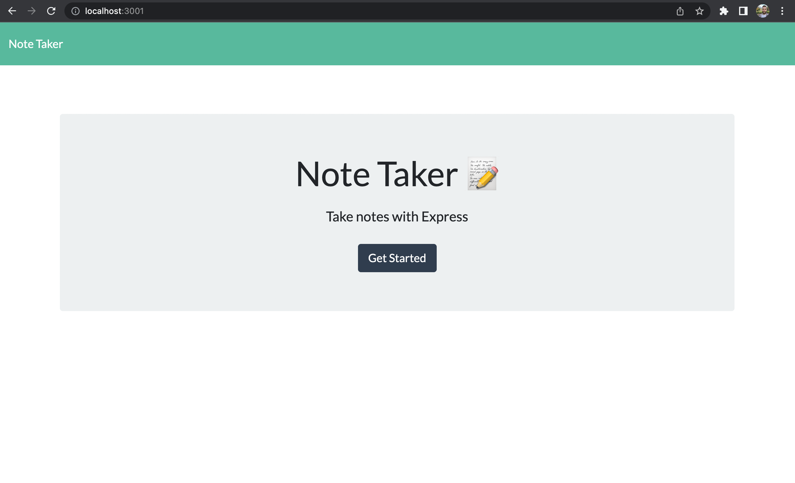
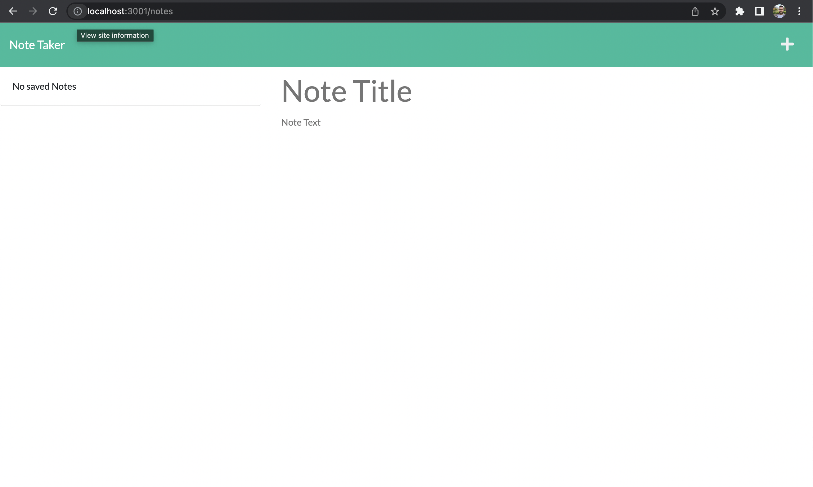
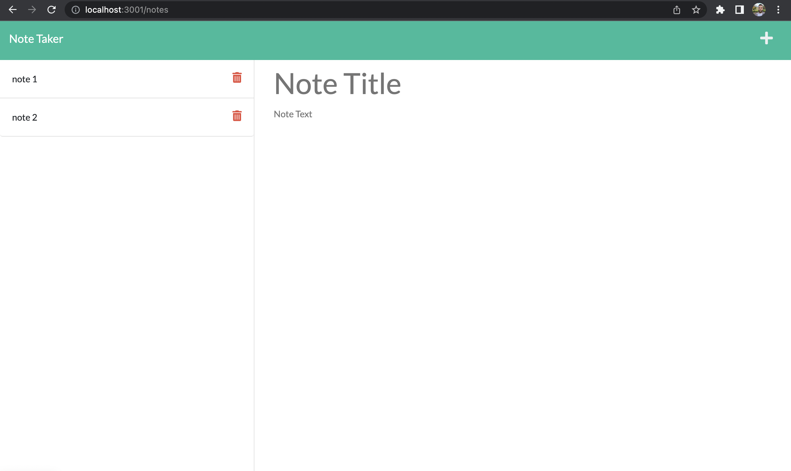
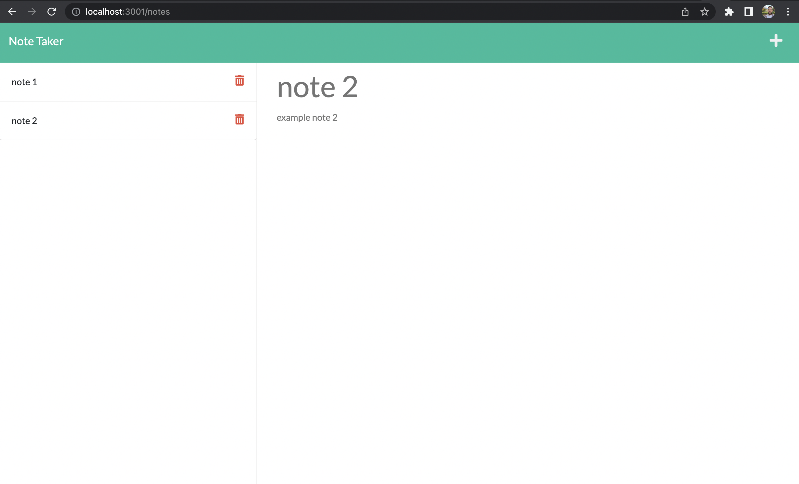

# express.js-note-taker
## Coding bootcamp week 11 challenge

This is a full stack application which allows the user to create, store and delete notes using an HTML user interface. In this challenge the code for the front end was provided. The back end needed to be created from scratch and connected to the front end. The challenge also required the entire finished application be deployed to Heroku.

This challenge's focus was on using express.js and creating HTML and API routes. The challenge also required the use of the npm module uuid to generate an id for the stored notes. I was able to use the mini-project to help with creating the back end code for this application, but still found it very challenging to complete.

### Installation

The user is required to type 'npm install' in the command line to install requried node modules. The user will then intialise a local server by typing 'node server.js'. The html file can then be viewed in a browser using the html link http://localhost:3001

### Usage

This is an application which allows the user to create, store and delete notes. The title of the saved notes is displayed on the left hand side of the notes HTML page, clicking on the title of the note will display its contents in the main part of the page on the right. Clicking the '+' icon adds a note, the disk icon saves the note and the red trash can icon will delete the note.

##### Below are screenshots of the user interface HTML files:

##### The repository for this application can be found at: 
https://github.com/TRN10/express.js-note-taker

##### Below is a link to the deployed application in Heroku:
https://peaceful-bayou-21485.herokuapp.com/